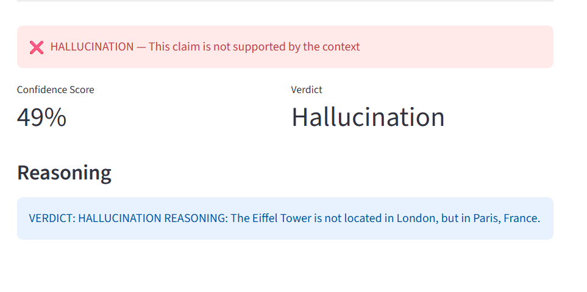
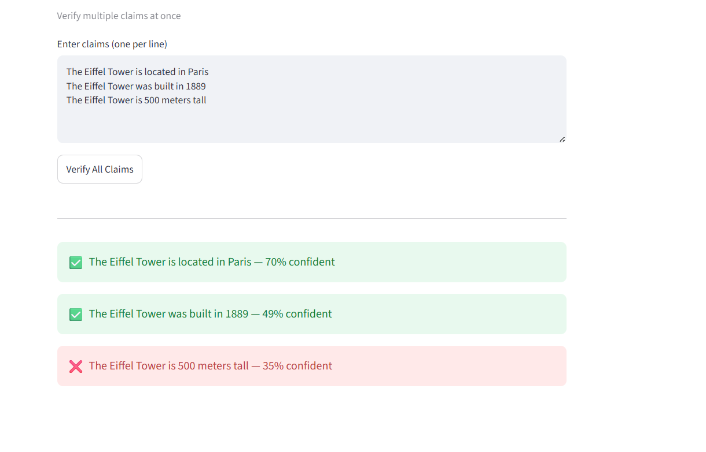

# 🛡️ Hallucination Insurance

A local-first AI fact-checking system that verifies whether LLM-generated claims are faithful to source documents — with zero API costs and complete privacy.

## How It Works
User provides: Claim + Source Context
↓
Verifier chunks the context into sentences
↓
Sentence-transformers converts claim + chunks to embeddings
↓
ChromaDB finds most semantically similar context chunks
↓
Ollama (Mistral) generates verdict and reasoning
↓
Returns: is_faithful, confidence_score, reasoning
## Features

- ✅ Single claim verification
- ✅ Batch verification — verify multiple claims at once
- ✅ Confidence scoring based on semantic similarity
- ✅ AI-powered reasoning for every verdict
- ✅ 100% local — no API keys, no cloud, complete privacy
- ✅ Streamlit UI for visual demos
- ✅ FastAPI backend for programmatic access

## Tech Stack

Python · FastAPI · Streamlit · Sentence-Transformers · ChromaDB · Ollama · Mistral

## Screenshots

### Single Verification


### Batch Verification


## Architecture
[Streamlit UI] → [FastAPI Backend] → [Verifier Service]
↓
[Sentence Transformers]
↓
[ChromaDB]
↓
[Ollama/Mistral]

## Setup

1. Install Ollama and pull Mistral
```bash
ollama pull mistral
```

2. Install dependencies
```bash
pip install -r requirements.txt
```

3. Start the API (Terminal 1)
```bash
uvicorn app.main:app --reload
```

4. Start the UI (Terminal 2)
```bash
streamlit run ui.py
```

5. Open http://localhost:8501

## API Endpoints

**Single verification:**
```bash
POST /verify
{
  "claim": "The Eiffel Tower is in London",
  "context": "The Eiffel Tower is located in Paris, France."
}
```

**Batch verification:**
```bash
POST /verify/batch
{
  "claims": ["claim 1", "claim 2"],
  "context": "source document here"
}
```

## Example Output

- ❌ "The Eiffel Tower is in London" → HALLUCINATION (49% confidence)
- ✅ "The Eiffel Tower is in Paris" → FAITHFUL (70% confidence)
- ❌ "The Eiffel Tower is 500m tall" → HALLUCINATION (35% confidence)